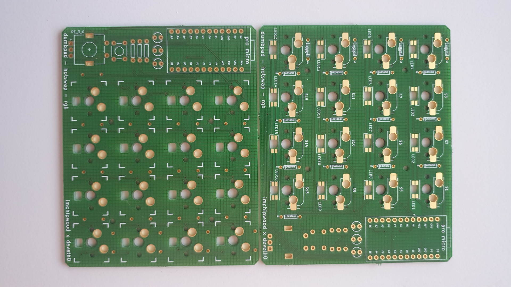
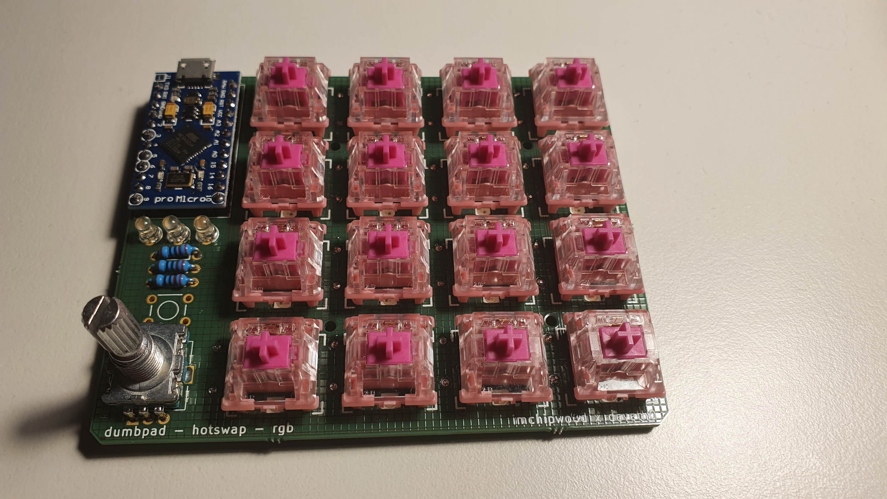
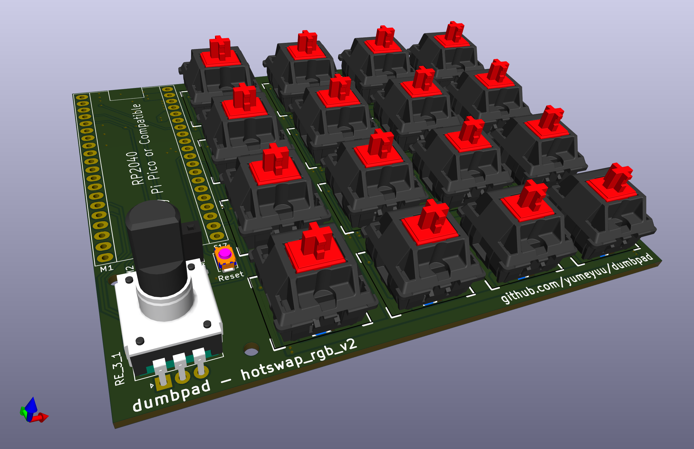
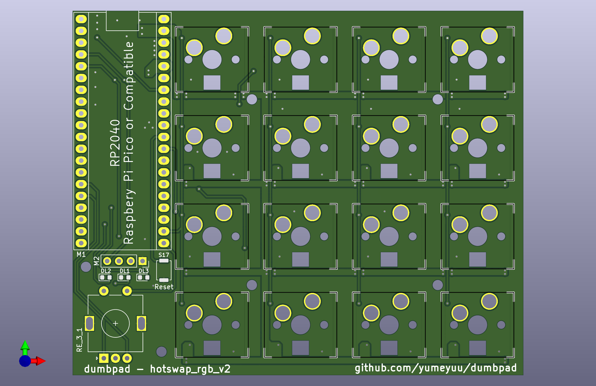
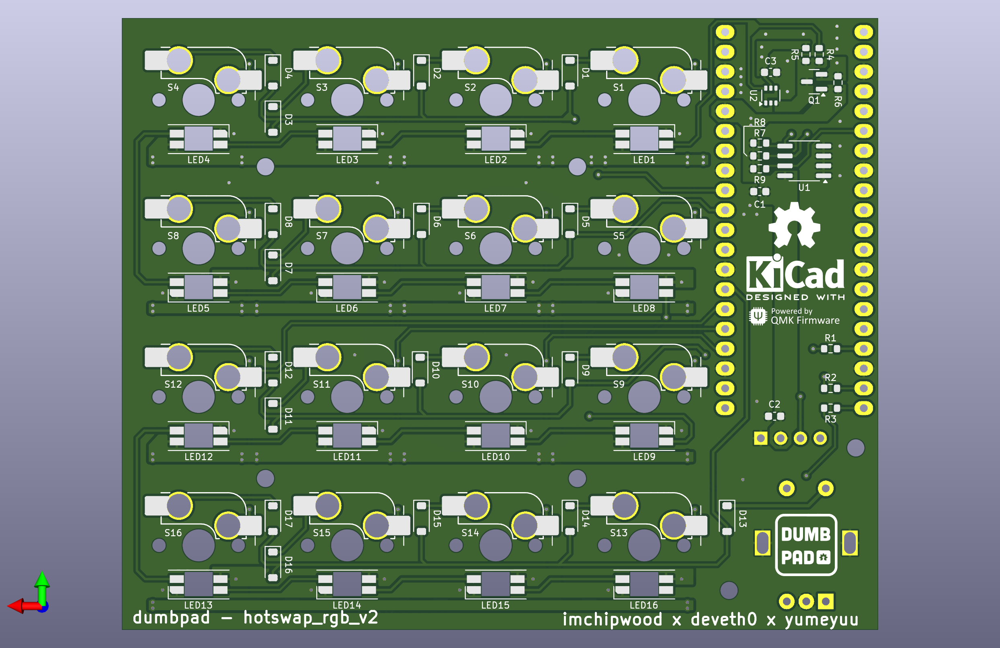
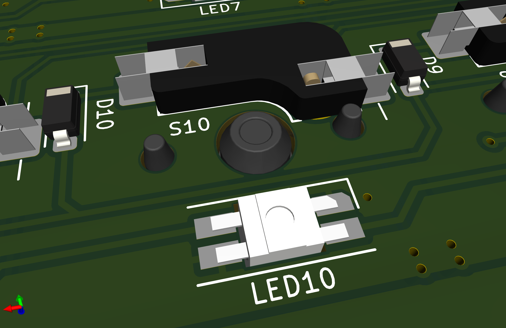
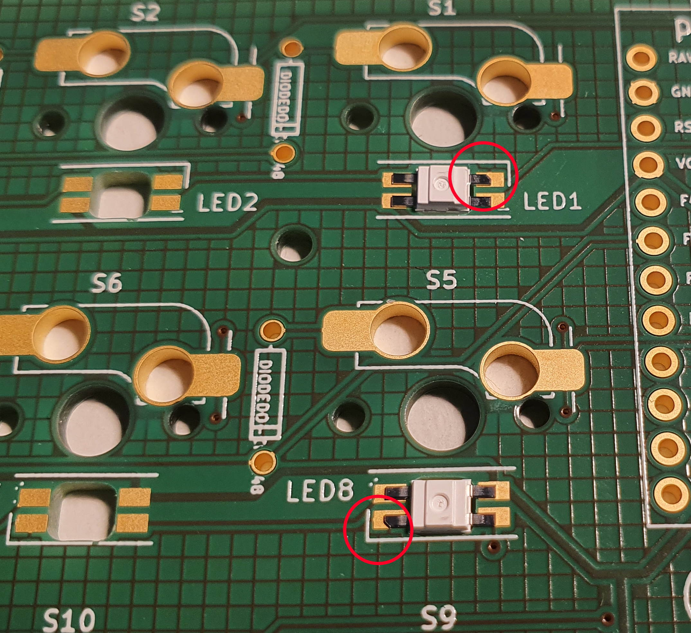

# dumbpad - Hotswap - RGB v2 (aka v4.x)

Originally Designed by [deveth0](https://www.github.com/deveth0).  
Modified by [yumeyuuu](https://github.com/yumeyuu) to fits RP2040 core board.   
Compatible board is [Rpi Pico](https://www.raspberrypi.com/documentation/microcontrollers/raspberry-pi-pico.html) or its clone.

## Description

Version of the original dumbpad that features Kailh Hotswap Sockets and (optional) RGB per-key lightning.  
Modified with additional EEPROM and OLED Screen

### Revisions

- 4.0 Initial file

#### dumbpad v4.0

#### Renders

### Bill of materials

| Qty   | Component     | Values             | Footprint        | Location      | Remarks                       |
| ---:  | :---          | :---               | :---             | :---          | :---:                         |
| 3     | Capacitor     | CAP 0.1u X7R 16V   | SMD 0603         | C1 - C3       |                               |
| 17    | Diodes        | 1N4148W            | SMD SOD123       | D1 - D17      |                               |
| 2     | LED           | Any Colors         | SMD LED 0603     | DL1, DL2      | Original layer indicator LED  |
| 1     | LED           | Any Colors         | SMD LED 0603     | DL3           | Original Numlock status LED   |
| 16    | LED           | SK6812MINI-E       | SK6812MINI-E     | LED1-LED16    | Optional                      |
| 1     | Processor     | RPi Pico           | Rpi Pico Pads    | M1            |                               |
| 1     | OLED Display  | 0.91" OLED Display | 2.54mm Scoket    | M2            |                               |
| 1     | NMOS          | 2N7002             | SOT-23           | Q1            | SK6812 Logic Level Shifter    |
| 3     | Resistor      | RES 1k             | SMD 0603         | R1 - R3       |                               |
| 1     | Resistor      | RES 0 (jumper)     | SMD 0603         | R4            | Bypass resistor               |
| 5     | Resistor      | RES 10k            | SMD 0603         | R5 - R9       | Optional                      |
| 1     | Encoder       | EC11 Rotary Encoder| 7 pins encoder   | RE_3_1        | Any EC11 Compatible OK        |
| 16    | KB-Socket     | Kailh Socket       | Kailh socket     | S1 - S16      |                               |
| 1     | Push Btn      | Alps SKRK          | ALPS SKRK        | S17           |                               |
| 1     | EEPROM        | 24LC32             | SOIC-8           | U1            |                               |
| 1     | Logic IC      | 74LVC2GU04GW       | SC-70            | U2            | Logic Level shifter           |

## Making the PCB

Submit either the KiCad `.kicad_pcb` or the gerber files to your prefered PCB manufacturer.  
Ensure your preffered PCB manufacturer able to process:
- Track Clearance 0.127 mm (5 mils)
- Track Width 0.127 mm (5 mils)
- Min Hole 0.3 mm 
- PCB size 1.6 mm (Common PCB size)

Prebuild gerber file located on the [gerber](gerber/) folder or file [hotswap_rgb_v2-gerber.zip](hotswap_rgb_v2-gerber.zip)

## Opening the design file

The design was created using KiCad 7.0.10 and should be compatible with later iteration.  
Using old version below 7.0 is not tested and probably not supported or could cause problem on the design.
Some of the footprint were not available on the standard KiCad library and hence available on the folder [dumbpad.pretty](dumbpad.pretty/).

### Notes on soldering

- Note 1:
This version uses SMD component, if You are unfamiliar with SMD component.  
Start with lowest possible temperature where Your solder wire can melt properly, and increase the temperature gradually until its flow easily on the solder pads.  
DON'T use high temperature or prolonged soldering time when doing the soldering. Otherwise, You may damage the component or melt the PCB lamination.  

- Note 2:
When soldering the socket and the LED it is recommended to use 360 degree C or as close as possible to this temperature.  
Especially when using Lead-Free solder alloy, its very critical to use lowest temperature where solder alloy can melt and flow easily.  
On my case 355 degree C is good temperature where the solder wire can melt easily and i have sufficient time to get best solder pads wetting.  

- Note 3:
The SK6812 LED plastic case, is very susceptible to melting! Use small solder tip and touch the PCB pads instead of the LED leads (Hakko BC-2 or similar should be good).  
Sometimes it is hard for solder alloy to wet the SK6812 LED lead frame, don't force high temperature or long soldering time!  
Instead, use some flux or clean the soldering area with IPA beforehand.  
On my build i saw some if some of the lead is not get enough solder wetting but i check with multimeter the soldering seems to be have connection. 
I suspect this due to poor storage of the SK6812 LED. (I just put in on the ESD bag with small desiccant, which probably not enough).  

- Note 4:
The SK6812 LED Pads were modified to include little chamfer to indicate GND Pin (Pin 3).

*WARNING:* 
Take a good look at the the orientation of the LEDs! 
The LED orientation changes with changes of the ROW! 

## Acknowledgements

Some of the footprints are extracted from the awesome [Corne Keyboard](https://github.com/foostan/crkbd) by [Kosuke Adachi](https://github.com/foostan).
